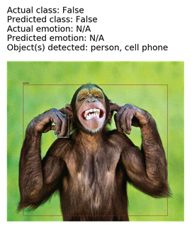

# CreepyEye

CreepyEye was an attempt to implement several data mining and machine learning techniques from multiple sources in order to process an image and identify several broad categories of elements. The components which comprise CreepyEye can detect human faces, eight emotions including surprise, fear, and sadness, and eighty everyday objects including books, teddy bears, and toothbrushes.

CreepyEye achieved an F1 of 0.955 on face detection and 0.161 on emotion detection.

Code will be posted in the near future. In the meantime you can check out [this poster](https://github.com/Bcromas/creepyeye/blob/master/creepyeye_poster.pdf){:target="_blank"}
